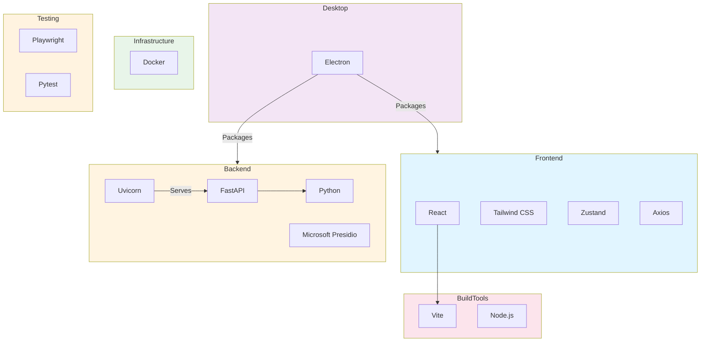

# RedactFlow

## Project Overview

RedactFlow is a local-only web application designed to help users safely process sensitive documents with external Large Language Models (LLMs) and then restore the original Personally Identifiable Information (PII). It achieves this by leveraging Microsoft Presidio for PII detection and anonymization, replacing sensitive data with unique tokens. After LLM processing, the original PII can be restored using a secure token map.

This application consists of two main parts:

- A **React/TypeScript frontend** for an intuitive user interface.
- A **Python/FastAPI backend** that handles PII detection, anonymization, and token management.

Both components are designed to run locally on your machine, ensuring that sensitive data never leaves your environment.

## Features

- **PII Detection & Anonymization:** Utilizes Microsoft Presidio to identify and replace sensitive information (e.g., names, emails, phone numbers, credit card numbers) with unique, reversible tokens.
- **Secure Token Mapping:** Maintains a temporary, in-memory map of tokens to original PII values, ensuring data privacy.
- **Guided Workflow:** A step-by-step interface guides users through document upload, sanitization, review, LLM output processing, and detokenization.
- **Local-Only Operation:** All processing occurs on your local machine, providing maximum control over your data.
- **Modern Glassmorphism UI:** A sleek, light-themed user interface featuring frosted glass effects, subtle gradients, and smooth animations for an intuitive and visually appealing experience.

## Installation (Desktop Application)

For the easiest way to run RedactFlow, download and install the pre-built desktop application from the project's official GitHub Releases. This version is self-contained and does not require Docker, Python, or Node.js to be installed on your system.

### Prerequisites

- Windows 10 or newer (64-bit)

### Steps

1. **Navigate to Releases:**
    - Go to the [**Releases**](https://github.com/DochertyDev/Redact-Flow/releases) page for this repository.

2. **Download the Installer:**
    - On the latest release, look under the **Assets** section.
    - Click on the `RedactFlow.Setup.X.Y.Z.exe` file to download it.

3. **Run the Installer:**
    - Double-click the downloaded `.exe` file.
    - Follow the on-screen instructions. It's generally safe to accept the default installation options.

4. **Launch RedactFlow:**
    - Once the installation is complete, you can launch RedactFlow from your Windows Start Menu or via the desktop shortcut that may have been created.

---

## Development Setup (Docker)

If you wish to contribute to RedactFlow or run it in a Dockerized development environment, follow these steps.

### Prerequisites

Before you begin, ensure you have the following installed:

- **Docker Desktop:** Ensure Docker Desktop is installed and running on your system. You can download it from the official Docker website.

### Setup

1. **Navigate to the Project Root Directory:**
    Open your terminal (e.g., PowerShell, Command Prompt, Git Bash) and navigate to the main `Redact-Flow` directory where the `docker-compose.yml` file is located.

    ```bash
    cd C:\Users\Sean\Projects\Redact-Flow
    ```

2. **Build the Docker Images:**
    This command reads the `Dockerfile`s for both the backend and frontend services and creates the necessary Docker images. You only need to run this command once, or whenever you make changes to the `Dockerfile`s or the `requirements.txt`/`package.json` files.

    ```bash
    docker compose build
    ```

---

## Development Setup (Local)

If you prefer to run the application without Docker, directly managing Python and Node.js environments and dependencies, follow these steps.

### Prerequisites (for Local Setup)

Before you begin, ensure you have the following installed:

- **Python 3.11:** [Download Python](https://www.python.org/downloads/)
- **Node.js 18+ & npm:** [Download Node.js](https://nodejs.org/en/download/)

### Backend Setup (Local)

1. **Navigate to the `backend` directory:**

    ```bash
    cd Redact-Flow/backend
    ```

2. **Create and activate a Python virtual environment:**

    ```bash
    python -m venv venv
    # On Windows:
    # .\venv\Scripts\activate
    # On macOS/Linux:
    # source venv/bin/activate
    ```

3. **Install backend dependencies:**

    ```bash
    pip install -r requirements.txt
    ```

4. **Install spaCy language model (required for Presidio):**

    ```bash
    python -m spacy download en_core_web_lg
    ```

5. **Create a `.env` file:**
    Copy the contents of `.env.example` to a new file named `.env` in the `backend` directory. You can modify the values if needed, but the defaults should work for local development.

    ```bash
    cp .env.example .env
    ```

### Frontend Setup (Local)

1. **Navigate to the `frontend` directory:**

    ```bash
    cd Redact-Flow/frontend
    ```

2. **Install frontend dependencies:**

    ```bash
    npm install
    ```

---

## Building the Desktop Installer

If you have made changes to the application and want to create a new distributable installer for Windows, follow these steps:

1. **Navigate to the `desktop` directory:**

   ```bash
   cd Redact-Flow/desktop
   ```

2. **Run the distribution command:**

   ```bash
   npm run dist
   ```

   This command will automatically build the frontend, copy the necessary files, and create a new installer in the `desktop/dist` directory.

---

## Running the Application

This section will now focus on how to run the application in its various forms.

### Running the Desktop Application

Simply launch "RedactFlow" from your Windows Start Menu or desktop shortcut after installation.

### Running in Development (Docker)

To start both the backend and frontend services using Docker Compose for development, navigate to the root `Redact-Flow` directory and use:

```bash
docker compose up -d
```

Once started, the application will typically be accessible in your web browser at `http://localhost:5173`.

To stop the application, run:

```bash
docker compose down
```

### Running in Development (Local)

1. **Start the Backend:**
    In a terminal, navigate to the `backend` directory, activate its virtual environment, and run:

    ```bash
    # Activate venv first (see Development Setup (Local))
    uvicorn app.main:app --reload --host 0.0.0.0 --port 8000
    ```

2. **Start the Frontend:**
    In a *separate* terminal, navigate to the `frontend` directory and run:

    ```bash
    npm run dev
    ```

Once both are running, the application will typically be accessible in your web browser at `http://localhost:5173`.

---

## Visuals

### High-Lelel Architecture Diagram


### Data Model ERD

```mermaid
erDiagram
    SANITIZE_REQUEST ||--|{ SANITIZE_RESPONSE : "generates"
    SANITIZE_RESPONSE ||--o{ TOKEN_INFO : "contains"
    SANITIZE_RESPONSE }|..|{ TOKEN_MAP_DATA : "creates"
    TOKEN_MAP_DATA ||--o{ TOKEN_MAPPING : "has"
    DETOKENIZE_REQUEST }|..|{ TOKEN_MAP_DATA : "uses"
    DETOKENIZE_REQUEST ||--|{ DETOKENIZE_RESPONSE : "generates"
    TOKEN_UPDATE_REQUEST }|..|{ TOKEN_MAP_DATA : "updates"
    MANUAL_TOKEN_REQUEST }|..|{ TOKEN_MAP_DATA : "updates"
    REVERT_TOKEN_REQUEST }|..|{ TOKEN_MAP_DATA : "updates"

    SANITIZE_REQUEST {
        string text
        dict presidio_config
    }

    SANITIZE_RESPONSE {
        string sanitized_text
        uuid token_map_id PK
        float processing_time_ms
        int additional_occurrences
    }

    TOKEN_INFO {
        string token
        string original_value
        string entity_type
        int start
        int end
        float score
    }

    TOKEN_MAP_DATA {
        uuid id PK
        string original_text
        datetime created_at
        datetime expires_at
    }

    TOKEN_MAPPING {
        string token PK
        uuid token_map_id FK
        string original_value
        string entity_type
        float score
    }

    DETOKENIZE_REQUEST {
        uuid token_map_id FK
        string text
    }

    DETOKENIZE_RESPONSE {
        string detokenized_text
        float processing_time_ms
    }

    TOKEN_UPDATE_REQUEST {
        uuid token_map_id FK
        list updates
    }

    MANUAL_TOKEN_REQUEST {
        uuid token_map_id FK
        string text_to_tokenize
        string entity_type
        int start
        int end
    }

    REVERT_TOKEN_REQUEST {
        uuid token_map_id FK
        string token
    }
```



### Tech Stack Diagram


